





<a href="https://developer.mozilla.org/en-US/docs/Web/HTML"></a>
<a href="https://developer.mozilla.org/en-US/docs/Web/CSS"></a>
<a href="https://developer.mozilla.org/en-US/docs/Web/JavaScript"></a>
<a href="https://www.typescriptlang.org/"></a>
<a href="https://react.dev/"></a>

<a href="https://nextjs.org/"></a>
<a href="https://www.better-auth.com/"></a>
<a href="https://nodejs.org/"></a>
<a href="https://www.mongodb.com/"></a>



<!-- PROJECTS:START -->

<a href="https://axit-lamiakajal.vercel.app/"></a>
<a href="https://lucid-lamiakajal.vercel.app"></a>
<a href="https://dev-stack-peach-chi.vercel.app"></a>

<!-- PROJECTS:END -->


<a href="https://lamiakajal.com"></a>
<a href="mailto:lamiakajal@gmail.com"></a>

<a href="https://www.linkedin.com/in/lamiakajal"></a>

<a href="https://www.behance.net/lamiakajal"></a>
<a href="https://www.pinterest.com/lamiakajal"></a>
<a href="https://www.binance.com/en/square/profile/lamiakajal"></a>





<picture>
  <source media="(prefers-color-scheme: dark)" srcset="https://raw.githubusercontent.com/lamiakajal/lamiakajal/output/github-snake-dark.svg" />
  <source media="(prefers-color-scheme: light)" srcset="https://raw.githubusercontent.com/lamiakajal/lamiakajal/output/github-snake.svg" />
  
</picture>




<!-- BLOG:START -->

<a href="https://lamiakajal.blogspot.com/2025/06/e-school-fully-responsive-user-friendly.html"></a>
<a href="https://lamiakajal.blogspot.com/2025/06/excited-to-launch-my-3rd-practice.html"></a>
<a href="https://lamiakajal.blogspot.com/2025/06/i-just-completed-my-2nd-web-project.html"></a>
<a href="https://lamiakajal.blogspot.com/2025/06/i-just-completed-my-first-practice.html"></a>

<!-- BLOG:END -->



