




<a href="https://developer.mozilla.org/en-US/docs/Web/HTML"></a>
<a href="https://developer.mozilla.org/en-US/docs/Web/CSS"></a>

<a href="https://nextjs.org/"></a>

<a href="https://mongoosejs.com/"></a>
<a href="https://git-scm.com/"></a>



<a href="mailto:lamiakajal@gmail.com"></a>

<a href="https://www.behance.net/lamiakajal"></a>
<a href="https://www.pinterest.com/lamiakajal"></a>

<picture>
  <source media="(prefers-color-scheme: dark)" srcset="https://raw.githubusercontent.com/lamiakajal/lamiakajal/output/github-snake-dark.svg" />
  <source media="(prefers-color-scheme: light)" srcset="https://raw.githubusercontent.com/lamiakajal/lamiakajal/output/github-snake.svg" />
  
</picture>

